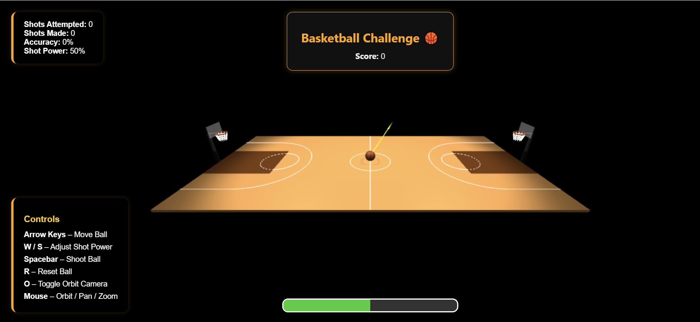
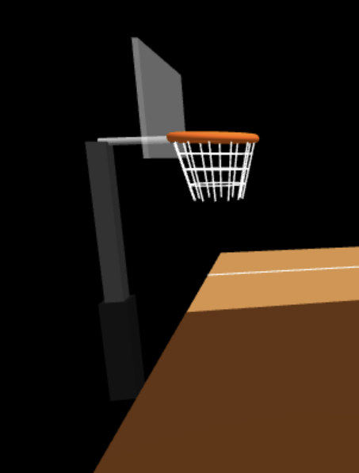
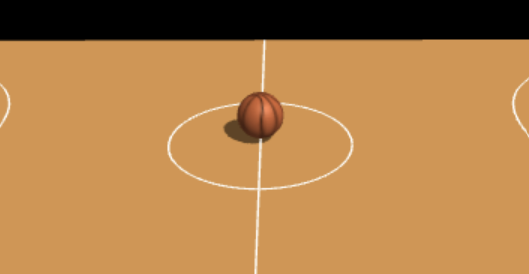
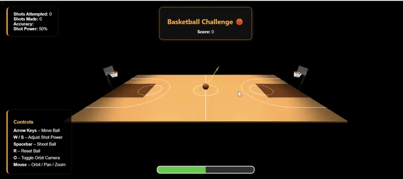

# 🏀 WebGL Basketball Game

Interactive 3D basketball court built with **Three.js**.  
Includes a full court, realistic hoops, physics-based ball movement, scoring system, and a clean UI.

---

## 🚀 Getting Started

1. Clone the repository
git clone https://github.com/shaniWhite/WebGL-Basketball-Court.git
cd webgl-basketball-game
2. Install dependencies
npm install
3. Run the development server
npm run dev
4. Open in your browser
Navigate to the local server URL shown in the terminal
(usually http://localhost:5173/).

---

## 🕹️ Controls

| Key           | Action                          |
|---------------|---------------------------------|
| ↑ / ↓ / ← / → | Move the basketball             |
| `W` / `S`     | Increase / Decrease shot power  |
| `SPACE`       | Shoot the ball                  |
| `R`           | Reset ball to center court      |
| `O`           | Toggle orbit camera             |
| `Mouse`       | Orbit, zoom, and pan camera     |

---

## ✨ Features

- Full basketball court with regulation markings

- Detailed hoops with backboard, rim, net, and support

- Physics-based gameplay (gravity, arc, bounce, rim detection)

- Scoreboard & live stats (shots, makes, accuracy, power)

- Dynamic UI with power bar, popup messages, and aiming arrow

- Smooth camera controls with orbit, zoom, and pan

---

## 🧠 Physics System

- Gravity & Trajectory: Ball follows a realistic arc based on power and direction.

- Shot Power & Angle: Velocity depends on power setting and hoop distance.

- Bouncing: Ball loses energy with each bounce until it stops.

- Rim & Ground Collision: Hoop detection ensures baskets only count from above.

---

## 📊 Scoring Rules

✅ Basket counts only if ball enters from above the rim

❌ Shots from underneath do not count

---

- ✅ Full Court

- ✅ Hoop Close-up

- ✅ Ball at Center Court  

- ✅ Camera Orbit Demo

- ✅ Physics Demo

