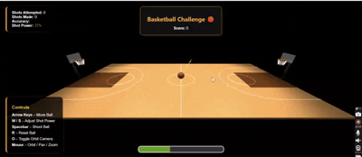

# Computer Graphics - Exercise 5 - WebGL Basketball Court

###### Group Members ############

- Shani White - 207880394   
- Daphne Messing - 322630518

###### ######################

## How to Run This Project

- Clone or download the repository to your local machine.
- Navigate to the project folder in your terminal.
- Run `npm install` to install all dependencies.
- Start the development server with `npm run dev`.
- Open the local server URL shown in the terminal (usually http://localhost:5173/) in a modern browser like Chrome.
- Use your mouse to interactively orbit, zoom, and pan around the basketball court.
- Ensure the folder structure is preserved, especially `/src`, `/screenshots`, and any texture assets used.

---

## 🕹️ Controls

| Key           | Action                          |
|---------------|---------------------------------|
| ↑ / ↓ / ← / → | Move the basketball             |
| `W` / `S`     | Increase / Decrease shot power  |
| `SPACE`       | Shoot the ball                  |
| `R`           | Reset ball to center court      |
| `O`           | Toggle orbit camera             |
| `Mouse`       | Orbit, zoom, and pan camera     |

---

## Features Implemented

✅ Regulation-size basketball court with:
- Court floor using `BoxGeometry`
- Center line and center circle
- Two three-point arcs (left and right)

✅ Two detailed basketball hoops with:
- Transparent rectangular backboards
- Orange torus-shaped rims at regulation height (3.05m)
- Net meshes with vertical and horizontal strands
- Diagonal support arms and vertical poles

✅ Static basketball:
- Proper orange color using a custom basketball texture
- Accurate size and position (center court)
- Includes black seam lines

✅ UI Elements:
- Scoreboard placeholder (`Score: 0`)
- On-screen control instructions

✅ Lighting & Camera:
- Ambient light with shadow casting
- Multiple directional spotlights simulate stadium lighting from above, casting realistic shadows and highlighting the court dynamically.
- Hemisphere Light:  
  Adds gentle fill light from sky and ground to soften shadow transitions and enhance realism.
- Initial camera positioned for court overview
- Orbit camera controls (toggle with **O** key)

---

## 🧠 Physics System

- **Gravity & Trajectory:**  
  The ball is affected by gravity and follows a parabolic arc based on power and direction.

- **Shot Power & Angle:**  
  Shot velocity is determined by both the user's power setting and distance to the hoop. Short shots use a steeper angle.

- **Realistic Bouncing:**  
  Ball bounces off the ground with energy loss until it settles.

- **Rim & Ground Collision:**  
  Hoop detection ensures the ball must enter from above to count. Rim radius is precisely measured.

---

## 📊 Scoring Logic

- ✅ Basket only counts if ball enters from **above**
- ❌ Shots from underneath are ignored
- 🧮 Live stats:  
  - Total shots  
  - Made shots  
  - Accuracy percentage  
  - Shot power

---

## ✨ Additional Features

- 🎯 Dynamic aiming arrow based on power and direction
- 🔁 Auto hoop targeting based on ball position
- 🌀 Ball rotates while flying for realism
- 💡 Visual power meter and animated UI panel
- 🎨 Clean responsive interface for game feedback

## Known Issues or Limitations
❌ The basketball uses a texture-mapped image for its visual design, not a procedurally generated or animated mesh
❌ Scoring logic is overly generous –  
Sometimes a basket is counted even if the ball only clips the rim or bounces nearby.  

## External Assets Used

- [basketball.png](./src/textures/basketball.png): Used as the texture for the basketball. (Instructor-provided or CC0 licensed if sourced externally)

## Screenshots
- ✅ Overall view of the basketball court with hoops  

- ✅ Close-up view of basketball hoops with nets 

- ✅ Basketball positioned at center court  

- ✅ Demonstration of camera orbit functionality  

- ✅ Demonstration of physics

